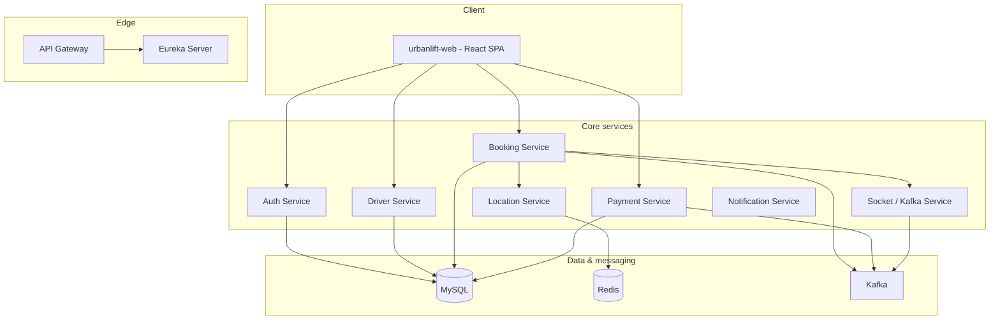

# UrbanLift

**UrbanLift** is a full-stack, microservices-style ride-hailing demo inspired by modern mobility apps. It showcases **distributed backend architecture**, **event-driven integration**, and a **production-minded React SPA** with validated forms, multi-role flows (rider + driver), and end-to-end trip and payment scenarios.

Use this project to demonstrate to recruiters that you can design **service boundaries**, work with **Spring Boot / cloud-native patterns**, **messaging**, **persistence**, and **typed frontends**—not only CRUD in a single monolith.

---

## Table of contents

- [Why this project (for recruiters)](#why-this-project-for-recruiters)
- [High-level architecture](#high-level-architecture)
- [Features](#features)
- [Technology stack](#technology-stack)
- [Repository structure](#repository-structure)
- [Prerequisites](#prerequisites)
- [Local setup](#local-setup)
- [Running the web app](#running-the-web-app)
- [Default ports](#default-ports)
- [Configuration & environment](#configuration--environment)
- [Testing APIs](#testing-apis)
- [What I learned / talking points](#what-i-learned--talking-points)
- [License](#license)

---

## Why this project (for recruiters)

| Area | What it demonstrates |
|------|----------------------|
| **Backend** | Multiple Spring Boot services, REST APIs, validation, global exception handling, JPA, Flyway migrations, shared domain module |
| **Cloud-style ops** | Netflix Eureka service discovery; API Gateway pattern; inter-service HTTP (Retrofit) |
| **Async & events** | Apache Kafka producers/consumers for domain events (e.g. booking lifecycle → payment side effects) |
| **Data** | MySQL for transactional data; Redis GEO for driver location indexing (Location Service) |
| **Security** | JWT in HTTP-only cookies for passenger and driver; Spring Security on auth services |
| **Frontend** | React 18 + TypeScript, Vite, Tailwind CSS, React Router, React Hook Form + Zod for client-side validation |
| **UX** | Rider and driver experiences: trip planning, **live socket location tracking**, trip lifecycle guards, payment + two-way ratings |

---

## High-level architecture



Riders and drivers use the **SPA** (default: Vite dev server with **reverse proxies** to backend ports). Services register with **Eureka** where applicable; **Booking** resolves **Location** and **Socket** via Eureka + Retrofit.

---

## Features

### Rider (passenger)

- Account **signup / sign-in** with server validation  
- **JWT** stored as **httpOnly** cookie; API returns **passenger id** on sign-in / session validation for seamless booking  
- **Trip planning**: named pickup/drop-off presets, optional **browser geolocation**, vehicle class selection  
- **Fare estimate** (Haversine distance + per-vehicle fare config)  
- **Create booking** with API idempotency (`Idempotency-Key`)  
- **Live trip** with polling + **WebSocket location stream** (`/topic/rideLocation/{bookingId}`)  
- **Mock payment**: initiate + confirm (configurable mock gateway)  
- **Rate driver** after completed ride

### Driver

- Multi-step **registration** with validated payloads  
- **Sign-in** with approval gate (`APPROVED` drivers only)  
- **Profile**, **GPS / availability**, **accept trip** by code, **advance trip status** (scheduled → arrived → in ride → completed)  
- **Rate passenger** after completed trip  
- **Estimated earnings** card from completed rides

### Platform

- **Flyway** migrations on shared schema concepts (e.g. `fare_config`, idempotency and ratings tables)  
- **Consistent JSON errors** (status, error, message) from Booking/Payment controllers  
- **CORS** enabled on Booking & Payment for direct browser access to `:8001` / `:8082` when not using a proxy  
- **Redlock-style booking lock** (Redis token+TTL lock with local fallback) to avoid duplicate active bookings under concurrency  
- Internal health endpoint: `GET /internal/health/flow` (flow + dependency readiness)
- N+1 mitigation in Booking read APIs via fetch-join repository queries for trip lists/details

---

## Technology stack

### Backend

| Technology | Usage |
|------------|--------|
| **Java 17** | Language |
| **Spring Boot 3.5.x** | REST APIs, JPA, validation, security (where applied) |
| **Spring Cloud 2025.x** | Eureka client, Spring Cloud Gateway |
| **Spring Kafka** | Event publishing / consumption |
| **MySQL** | Primary relational store |
| **Redis + Jedis** | Driver locations / GEO-style lookups (Location Service) |
| **Flyway** | Versioned SQL migrations (Entity + consumers) |
| **JJWT 0.12.x** | JWT creation and validation |
| **Retrofit / OkHttp** | Type-safe HTTP clients between services |
| **Lombok** | Boilerplate reduction |
| **Gradle** | Build tool |

### Frontend (`urbanlift-web/`)

| Technology | Usage |
|------------|--------|
| **React 18** | UI |
| **TypeScript** | Type safety |
| **Vite 5** | Dev server & production build |
| **Tailwind CSS 3** | Styling |
| **React Router 6** | SPA routing |
| **React Hook Form** | Form state |
| **Zod** | Schema validation (aligned with backend rules) |
| **STOMP + SockJS** | Live location subscription/publish on ride-in-progress |

### Infrastructure (local)

| Component | Role |
|-----------|------|
| **Netflix Eureka** | Service registry |
| **Apache Kafka** | Async messaging between services |
| **MySQL** | `uber_db_local` (default in `application.yaml` files) |
| **Redis** | Used by Location Service |

---

## Repository structure

| Path | Description |
|------|-------------|
| `urbanlift-web/` | React + Vite SPA (rider & driver UIs) |
| `Uber-EntityService/` | Shared JPA entities, Flyway migrations; published as a JAR for other services |
| `Uber-ServiceDiscovery-Eureka/` | Eureka server |
| `Uber-API-Gateway/` | Spring Cloud Gateway (+ JWT filter patterns where configured) |
| `Uber-AuthService/` | Passenger auth, JWT cookie |
| `Uber-DriverService/` | Driver auth, profile, availability, location forward |
| `Uber-BookingService/` | Bookings, status transitions, Kafka, integration with Location & Socket |
| `Uber-PaymentService/` | Fare estimates, payment initiate/confirm, Kafka |
| `Uber-LocationService/` | Redis-backed driver location |
| `Uber-SocketKafkaService/` | WebSocket / Kafka bridge for real-time style flows |
| `Uber-NotificationService/` | Notification handling |
| `deploy/` | Docker Compose + Kubernetes starter manifests (infra + app templates) |
| `URBANLIFT_API_TESTING_GUIDE.md` / Postman collection | API testing reference (if present in repo) |

---

## Prerequisites

- **JDK 17**  
- **Gradle** (wrapper included per service)  
- **Node.js 18+** and **npm** (for `urbanlift-web`)  
- **MySQL 8+** (local instance, database created per your `application.yaml`)  
- **Redis** (for Location Service)  
- **Apache Kafka** (for Booking/Payment/Socket flows that use topics)  
- **Eureka** running before services that depend on discovery for Retrofit base URLs  

---

## Local setup

### 1. Database

Create a database (default name in configs is often `uber_db_local`). Update `spring.datasource` in each service’s `application.yaml` if your user/password differ from `root`/`root`.

### 2. Shared entity JAR

Other services depend on **`com.example:Uber-EntityService:0.0.4-SNAPSHOT`** (see each module’s `build.gradle`). Publish to **Maven Local** from the Entity module:

```bash
cd Uber-EntityService/Uber-EntityService
./gradlew publishToMavenLocal   # Windows: gradlew.bat publishToMavenLocal
```

> If your `Uber-EntityService` `build.gradle` still points `publishing.repositories` to a machine-specific path, switch it to **`mavenLocal()`** or a shared artifact repo so clones build cleanly.

### 3. Start infrastructure

- Start **Zookeeper/Kafka** (or your local Kafka stack) on **`localhost:9092`** (default in YAML).  
- Start **Redis** for Location Service.  
- Start **Eureka**: `Uber-ServiceDiscovery-Eureka` (port **8761**).

### 4. Start microservices (typical order)

1. **Entity Service** (if you run it standalone for migrations/admin; port **7476** by default)  
2. **Auth Service** — **7475**  
3. **Driver Service** — **8081**  
4. **Location Service** — **7777**  
5. **Socket / Kafka Service** — **3002**  
6. **Booking Service** — **8001**  
7. **Payment Service** — **8082**  
8. **Notification Service** — **8083** (if used)  
9. **API Gateway** — **8080** (optional if you route via gateway instead of direct + Vite proxy)

Use each module’s Gradle bootRun:

```bash
./gradlew bootRun
```

Ensure Flyway migrations have run so tables exist (including **`fare_config`** seeds in Entity, plus Booking repeatable migrations for `booking_idempotency` and `trip_rating`).

---

## Running the web app

```bash
cd urbanlift-web
npm install
npm run dev
```

Open **`http://localhost:5173`**.

By default, **`vite.config.ts`** proxies:

| Dev path | Target (example) |
|----------|-------------------|
| `/__auth` | `http://localhost:7475` |
| `/__driver` | `http://localhost:8081` |
| `/__booking` | `http://localhost:8001` |
| `/__payment` | `http://localhost:8082` |
| `/__socket` | `http://localhost:3002` |

This keeps the browser on **one origin** so **cookies** and **CORS** behave predictably during development.

---

## Default ports

| Service | Port |
|---------|------|
| Eureka | 8761 |
| API Gateway | 8080 |
| Auth | 7475 |
| Entity (if run) | 7476 |
| Driver | 8081 |
| Payment | 8082 |
| Notification | 8083 |
| Booking | 8001 |
| Location | 7777 |
| Socket / Kafka bridge | 3002 |
| Vite (SPA) | 5173 |

---

## Configuration & environment

### Frontend (`urbanlift-web`)

Optional `.env` (see `urbanlift-web/.env.example`):

- `VITE_AUTH_API_BASE`, `VITE_DRIVER_API_BASE`, `VITE_BOOKING_API_BASE`, `VITE_PAYMENT_API_BASE`, `VITE_SOCKET_API_BASE` — override API bases  
- `VITE_USE_PROXY=false` — call backends directly (requires CORS; Booking/Payment allow `localhost:5173`)

### Backend

- **JWT** secrets and expiry in each auth module’s config  
- **Payment**: mock gateway flag in Payment Service `application.yaml` (`payment.gateway.mock`)  
- **Booking lock config**: `urbanlift.lock.booking-create.*` and `spring.data.redis.*` in Booking `application.yaml`

---

## Testing APIs

- Use the project’s **Postman collection** or **`URBANLIFT_API_TESTING_GUIDE.md`** (if included) for request shapes and sample flows.  
- Happy path: **signup rider → sign-in → estimate fare → create booking → driver accept / status updates → payment initiate/confirm → rider/driver ratings**.  
- Runtime flow health: call `GET /internal/health/flow` on Booking service.

---

## What I learned / talking points

- Splitting **bounded contexts** (auth, driver ops, booking, payments, location) into deployable units.  
- **Discovery vs hard-coded URLs**—and when to use **Retrofit** with dynamic bases from Eureka.  
- **Event-driven** decoupling with **Kafka** (e.g. booking completed → downstream processing).  
- **Schema evolution** with **Flyway** and shared **entity** module versioning.  
- **Security trade-offs**: httpOnly cookies vs localStorage; CORS and credentials.  
- **Frontend discipline**: Zod + RHF mirroring server validation; polling vs sockets for “live” trip UX.  

---

## License

This project is provided for **portfolio and educational** use. Add a `LICENSE` file (e.g. MIT) if you plan to open-source it formally.

---

## Author

**Dev Gupta** — [LinkedIn](https://www.linkedin.com/) · [Portfolio](https://devgupta.com)  

